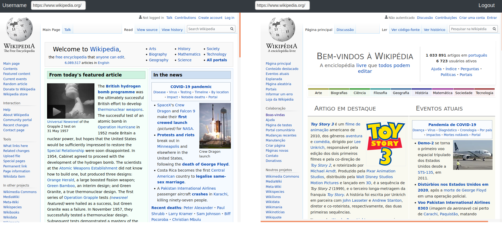

This project was bootstrapped with [Create React App](https://github.com/facebook/create-react-app).

## Available Scripts

In the project directory, you can run:
### `yarn install`
It install all the dependencies and the node modules.

### `yarn start`

Runs the app in the development mode. 
Open [http://localhost:3000](http://localhost:3000) to view it in the browser.

* make sure you have [npm](https://www.npmjs.com/get-npm) or [yarn](https://classic.yarnpkg.com/en/docs/install/#debian-stable) and [create-react-app](https://reactjs.org/docs/create-a-new-react-app.html) install in your system.

 
On Starting the browser thw screenshots are :

    
     
     

 

    
     
     

 

    
     
     

 

    
     
     

 
